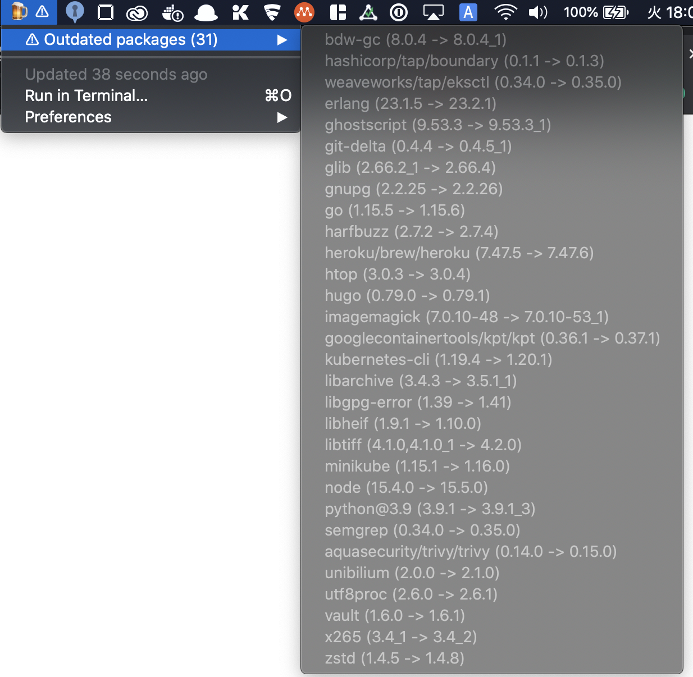

# brewbar

Display outdated packages installed by Homebrew with BitBar.



## Requirements

* jq
* bitbar

## Install

```shell
$ make install

# Enable uptime plugin and change update interval to 12 hours (Default: 24 hours)
$ make install INTERVAL=12h
```
